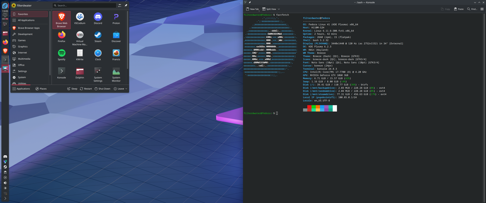
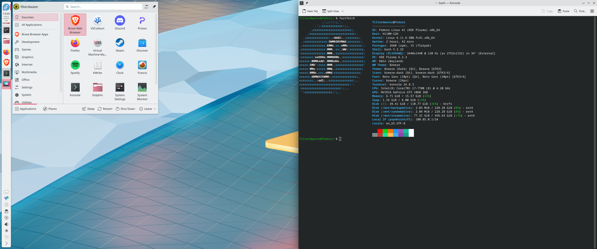

In this post, I’ll walk you through the key components of my setup that keep my workflow smooth and enjoyable.

---

## <span class="flex items-center gap-2"> <svg xmlns="http://www.w3.org/2000/svg" class="size-7 text-stone-900 dark:text-stone-100" viewBox="0 0 24 24"><path fill="currentcolor" d="M12.001 0C5.376 0 .008 5.369.004 11.992H.002v9.287h.002A2.726 2.726 0 0 0 2.73 24h9.275c6.626-.004 11.993-5.372 11.993-11.997C23.998 5.375 18.628 0 12 0zm2.431 4.94c2.015 0 3.917 1.543 3.917 3.671c0 .197.001.395-.03.619a1 1 0 0 1-1.137.893a1 1 0 0 1-.842-1.175a3 3 0 0 0 .013-.337c0-1.207-.987-1.672-1.92-1.672c-.934 0-1.775.784-1.777 1.672c.016 1.027 0 2.046 0 3.07l1.732-.012c1.352-.028 1.368 2.009.016 1.998l-1.748.013c-.004.826.006.677.002 1.093c0 0 .015 1.01-.016 1.776c-.209 2.25-2.124 4.046-4.424 4.046c-2.438 0-4.448-1.993-4.448-4.437c.073-2.515 2.078-4.492 4.603-4.469l1.409-.01v1.996l-1.409.013h-.007c-1.388.04-2.577.984-2.6 2.47a2.44 2.44 0 0 0 2.452 2.439c1.356 0 2.441-.987 2.441-2.437l-.001-7.557c0-.14.005-.252.02-.407c.23-1.848 1.883-3.256 3.754-3.256"/></svg> Operating System </span>

I'm currently using [Fedora KDE Plasma](https://fedoraproject.org/spins/kde/) as my daily driver on both my desktop and laptop.

Previously, I've used both [Fedora Workstation](https://fedoraproject.org/workstation/) and [Ubuntu LTS](https://ubuntu.com/desktop), both of which come with [GNOME](https://www.gnome.org/) as the default desktop environment. After spending a good amount of time with GNOME, I decided to try [KDE Plasma](https://kde.org/plasma-desktop/) for a change.

## KDE Plasma vs. GNOME

##### <span class="flex items-center gap-2"> <svg xmlns="http://www.w3.org/2000/svg" class="size-5 text-stone-900 dark:text-stone-100" viewBox="0 0 24 24"><path fill="currentcolor" d="M13.881 0L9.89.382v16.435l3.949-.594V9.216l5.308 7.772l4.162-1.317l-5.436-7.475l5.479-7.05L19.105.17L13.84 7.22zM4.834 4.005a.2.2 0 0 0-.123.059L3.145 5.63a.2.2 0 0 0-.03.248L4.949 8.9a7.8 7.8 0 0 0-.772 1.759l-3.367.7a.2.2 0 0 0-.162.199v2.215c0 .093.064.174.155.196l3.268.8a7.8 7.8 0 0 0 .801 2.03L2.98 19.683a.2.2 0 0 0 .027.254l1.566 1.567a.204.204 0 0 0 .249.03l2.964-1.8c.582.336 1.21.6 1.874.78l.692 3.325c.02.094.102.161.198.161h2.215a.2.2 0 0 0 .197-.155l.815-3.332a7.8 7.8 0 0 0 1.927-.811l2.922 1.915c.08.053.186.042.254-.026l1.567-1.566a.2.2 0 0 0 .03-.248l-1.067-1.758l-.345.11a.12.12 0 0 1-.135-.047L17.371 15.8a6.347 6.347 0 1 1-8.255-8.674V5.488c-.401.14-.79.31-1.159.511l-.001-.002l-2.99-1.96a.2.2 0 0 0-.132-.033Z"/></svg> KDE Plasma </span>

1. Superior scaling support
2. Feature-rich default applications
3. Vast customization options right out of the box

##### <span class="flex items-center gap-2"> <svg xmlns="http://www.w3.org/2000/svg" class="size-5 text-stone-900 dark:text-stone-100" viewBox="0 0 24 24"><path fill="currentcolor" d="M19.703 0c-4.99 0-5.927 7.111-3.12 7.111c2.81 0 8.113-7.111 3.12-7.111M11.99.872q-.119-.001-.25.016c-2.811.364-1.82 5.25-.324 5.34c1.449.09 3.032-5.347.574-5.356M7.123 2.803a1.4 1.4 0 0 0-.488.114c-2.259.933-.344 4.776.921 4.519c1.168-.24 1.319-4.671-.433-4.632Zm-3.6 3.016a1.05 1.05 0 0 0-.634.215c-1.807 1.248.607 4.269 1.671 3.799c.93-.41.338-3.967-1.037-4.014m10.032 2.309c-3.835.033-8.716 1.978-9.567 5.784C3.044 18.14 7.875 24 12.915 24c2.48 0 5.34-2.24 5.875-5.077c.409-2.163-4.81-1.295-4.623.137c.225 1.715-1.258 2.561-2.711 1.454c-4.623-3.52 7.658-5.276 6.847-10.086c-.263-1.56-2.29-2.322-4.748-2.301Z"/></svg> GNOME </span>

1. More efficient workspace management
2. Minimal by default
3. Default on many popular distributions

I'm enjoying KDE Plasma so far and don't plan to switch back to GNOME anytime soon, as I haven't found myself missing any functionality.




---

## <span class="flex items-center gap-2"> <svg xmlns="http://www.w3.org/2000/svg" class="size-7 text-stone-900 dark:text-stone-100" viewBox="0 0 24 24"><path fill="currentcolor" d="M11.583.54a1.467 1.467 0 0 0-.441 2.032c2.426 3.758 2.999 6.592 2.75 9.075c-1.004 4.756-3.187 5.721-5.094 5.721c-1.863 0-1.364-3.065.036-3.962c.836-.522 1.906-.861 2.728-.861c.814 0 1.474-.658 1.474-1.47s-.66-1.47-1.474-1.47c-.96 0-1.901.202-2.78.545c.18-.847.246-1.762.014-2.735c-.352-1.477-1.367-2.889-3.128-4.257a1.476 1.476 0 0 0-2.069.256c-.5.64-.384 1.564.259 2.063c1.435 1.114 1.908 1.939 2.07 2.618s.032 1.407-.293 2.408c-.416 1.349-.9 2.553-1.11 3.708c-.105.568-.114 1.187-.14 1.68c-1.034-1.006-1.438-2.336-1.438-4.279c0-.811-.66-1.47-1.474-1.47A1.47 1.47 0 0 0 0 11.612c0 2.654.776 5.179 2.855 6.863c1.883 1.793 6.67 1.13 6.67 4.01c0 .812 1.19 1.208 2.004 1.208c.834 0 1.885-.558 1.885-1.208c0-3.267 3.443-5.253 9.11-5.244A1.47 1.47 0 0 0 24 15.773a1.47 1.47 0 0 0-1.47-1.473q-.58.001-1.138.035c.634-1.49.915-3.13.857-4.903a1.473 1.473 0 0 0-1.522-1.42a1.47 1.47 0 0 0-1.425 1.517c.076 2.32-.01 4.393-1.74 5.485c-.49.31-1.062.58-1.604.58c.42-1.145.738-2.353.869-3.655c.083-.83.091-1.818-.003-2.585c-.148-1.188-.325-2.535.126-3.55c.405-.874 1.313-1.24 2.645-1.24c.814 0 1.473-.659 1.473-1.47s-.659-1.47-1.473-1.47c-1.98 0-3.481 1.042-4.332 2.3A25 25 0 0 0 13.621.981a1.474 1.474 0 0 0-2.037-.44z"/></svg> Code editor </span>

[VSCodium](https://vscodium.com/) is currently my go to.

Microsoft’s Visual Studio Code (aka VSCode) is open-source (MIT), but the official version includes proprietary features like telemetry. VSCodium offers a telemetry-free, MIT-licensed build of VS Code without the extra Microsoft customizations.

If you want the VSCode extensions Marketplace when using VSCodium follow the instructions below.

Please note: Some extensions might not work with VSCodium. You can check the [VSCodium GitHub repository](https://github.com/VSCodium/vscodium/blob/master/docs/index.md) to see which extensions are compatible or need extra configurations.

> **Warning:** These instructions might reset your VSCodium settings after they are applied.

**Important:** This tutorial is written for Linux. If you are using a different operating system, the instructions may vary.

### Instructions

1. Open your terminal and enter the following command to change the directory to the VSCodium configuration folder.

   ```bash
   cd ~/.config/VSCodium
   ```

2. Create a new file named product.json with the following command.

   ```bash
   touch product.json
   ```

3. Open the product.json file in a text editor.

   ```bash
   nano product.json
   ```

4. Paste the following JSON configuration into the product.json file to enable the VSCode Extensions Marketplace.

   ```json
   {
     "nameShort": "Visual Studio Code",
     "nameLong": "Visual Studio Code",
     "extensionsGallery": {
       "serviceUrl": "https://marketplace.visualstudio.com/_apis/public/gallery",
       "cacheUrl": "https://vscode.blob.core.windows.net/gallery/index",
       "itemUrl": "https://marketplace.visualstudio.com/items"
     }
   }
   ```

5. After pasting the configuration, save the file and exit the editor. If using nano, press CTRL + O and then ENTER to save and CTRL + X to exit.

6. Finally, restart or startup VSCodium. You should now have access to the VSCode Extensions Marketplace.

---

## <span class="flex items-center gap-2"> <svg xmlns="http://www.w3.org/2000/svg" class="size-7 text-stone-900 dark:text-stone-100" viewBox="0 0 24 24"><path fill="currentcolor" d="m15.68 0l2.096 2.38s1.84-.512 2.709.358c.868.87 1.584 1.638 1.584 1.638l-.562 1.381l.715 2.047s-2.104 7.98-2.35 8.955c-.486 1.919-.818 2.66-2.198 3.633a186 186 0 0 1-4.293 2.916c-.409.256-.92.692-1.38.692s-.97-.436-1.38-.692a186 186 0 0 1-4.293-2.916c-1.38-.973-1.712-1.714-2.197-3.633c-.247-.975-2.351-8.955-2.351-8.955l.715-2.047l-.562-1.381s.716-.768 1.585-1.638c.868-.87 2.708-.358 2.708-.358L8.321 0h7.36zm-3.679 14.936c-.14 0-1.038.317-1.758.69s-1.242.637-1.409.742s-.065.301.087.409s2.194 1.69 2.393 1.866c.198.175.489.464.687.464s.49-.29.688-.464s2.24-1.759 2.392-1.866s.254-.305.087-.41s-.689-.368-1.41-.741c-.72-.373-1.617-.69-1.757-.69m0-11.278s-.409.001-1.022.206s-1.278.46-1.584.46s-2.581-.434-2.581-.434s-2.695 3.262-2.695 3.959s.339.881.68 1.243l2.02 2.149c.192.203.59.511.356 1.066c-.235.555-.58 1.26-.196 1.977c.384.716 1.042 1.194 1.464 1.115c.421-.08 1.412-.598 1.776-.834c.364-.237 1.518-1.19 1.518-1.554s-1.193-1.02-1.413-1.168c-.22-.15-1.226-.725-1.247-.95c-.02-.227-.012-.293.284-.851c.297-.559.831-1.304.742-1.8c-.089-.495-.95-.753-1.565-.986s-1.799-.671-1.947-.74s-.11-.133.339-.175c.448-.043 1.719-.212 2.292-.052s1.552.403 1.632.532c.079.13.149.134.067.579s-.5 2.581-.541 2.96c-.04.38-.12.63.288.724c.409.094 1.097.256 1.333.256s.924-.162 1.333-.256c.408-.093.329-.344.288-.723c-.04-.38-.46-2.516-.541-2.961s-.012-.45.067-.579c.08-.129 1.059-.372 1.632-.532s1.845.009 2.292.052c.449.042.487.107.339.175c-.148.069-1.332.508-1.947.74c-.615.233-1.476.49-1.565.986c-.09.496.445 1.241.742 1.8s.304.624.284.85s-1.026.802-1.247.95c-.22.15-1.413.804-1.413 1.169c0 .364 1.154 1.317 1.518 1.554c.364.236 1.355.755 1.776.834s1.08-.4 1.464-1.115c.384-.716.039-1.422-.195-1.977s.163-.863.355-1.066l2.02-2.149c.341-.362.68-.546.68-1.243s-2.695-3.96-2.695-3.96s-2.274.436-2.58.436s-.972-.256-1.585-.461s-1.022-.206-1.022-.206"/></svg> Browser </span>

I’ve been a longtime user of the [Brave](https://brave.com/) browser, choosing it over Google Chrome for its robust, built-in privacy features. While I occasionally use [Firefox](https://www.mozilla.org/en-US/firefox/new/?redirect_source=firefox-com), Brave remains my go-to browser.

---

## <span class="flex items-center gap-2"> <svg xmlns="http://www.w3.org/2000/svg" class="size-7 text-stone-900 dark:text-stone-100" viewBox="0 0 24 24"><path fill="currentcolor" d="M13.983 11.078h2.119a.186.186 0 0 0 .186-.185V9.006a.186.186 0 0 0-.186-.186h-2.119a.185.185 0 0 0-.185.185v1.888c0 .102.083.185.185.185m-2.954-5.43h2.118a.186.186 0 0 0 .186-.186V3.574a.186.186 0 0 0-.186-.185h-2.118a.185.185 0 0 0-.185.185v1.888c0 .102.082.185.185.185m0 2.716h2.118a.187.187 0 0 0 .186-.186V6.29a.186.186 0 0 0-.186-.185h-2.118a.185.185 0 0 0-.185.185v1.887c0 .102.082.185.185.186m-2.93 0h2.12a.186.186 0 0 0 .184-.186V6.29a.185.185 0 0 0-.185-.185H8.1a.185.185 0 0 0-.185.185v1.887c0 .102.083.185.185.186m-2.964 0h2.119a.186.186 0 0 0 .185-.186V6.29a.185.185 0 0 0-.185-.185H5.136a.186.186 0 0 0-.186.185v1.887c0 .102.084.185.186.186m5.893 2.715h2.118a.186.186 0 0 0 .186-.185V9.006a.186.186 0 0 0-.186-.186h-2.118a.185.185 0 0 0-.185.185v1.888c0 .102.082.185.185.185m-2.93 0h2.12a.185.185 0 0 0 .184-.185V9.006a.185.185 0 0 0-.184-.186h-2.12a.185.185 0 0 0-.184.185v1.888c0 .102.083.185.185.185m-2.964 0h2.119a.185.185 0 0 0 .185-.185V9.006a.185.185 0 0 0-.184-.186h-2.12a.186.186 0 0 0-.186.186v1.887c0 .102.084.185.186.185m-2.92 0h2.12a.185.185 0 0 0 .184-.185V9.006a.185.185 0 0 0-.184-.186h-2.12a.185.185 0 0 0-.184.185v1.888c0 .102.082.185.185.185M23.763 9.89c-.065-.051-.672-.51-1.954-.51q-.508.001-1.01.087c-.248-1.7-1.653-2.53-1.716-2.566l-.344-.199l-.226.327c-.284.438-.49.922-.612 1.43c-.23.97-.09 1.882.403 2.661c-.595.332-1.55.413-1.744.42H.751a.75.75 0 0 0-.75.748a11.4 11.4 0 0 0 .692 4.062c.545 1.428 1.355 2.48 2.41 3.124c1.18.723 3.1 1.137 5.275 1.137a15.7 15.7 0 0 0 2.93-.266a12.3 12.3 0 0 0 3.823-1.389a10.5 10.5 0 0 0 2.61-2.136c1.252-1.418 1.998-2.997 2.553-4.4h.221c1.372 0 2.215-.549 2.68-1.009c.309-.293.55-.65.707-1.046l.098-.288Z"/></svg> Containerization </span>

In 2024, I set a goal to learn containerization and have been using [Docker](https://www.docker.com/) as my primary tool.

Initially, I experimented with [Podman](https://podman.io/), which is designed with enhanced security compared to Docker. However, I decided to focus on Docker for now due to its broader adoption and community support. Perhaps once I’ve become a container aficionado, I’ll revisit Podman to explore its advantages in more depth.

---

## And that's basically it!

Aside from a few other small tools like [Tmux](https://github.com/tmux/tmux/wiki/), this setup covers everything I need to get work done effectively. My goal for 2024 is to become so proficient with containers that I can avoid installing tools like Node.js directly on my machine and run everything in project specific containers instead.
