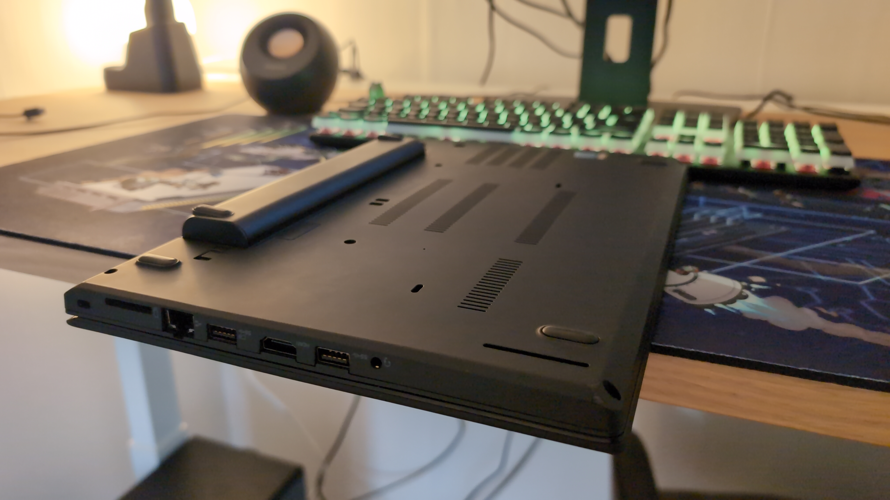
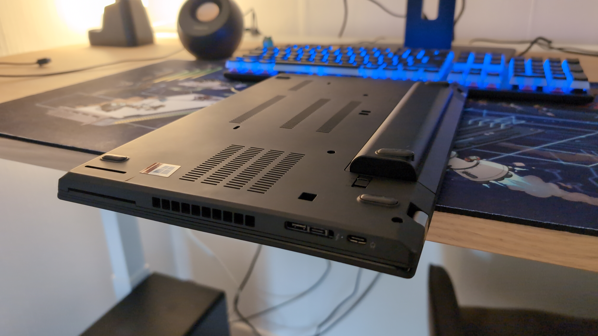
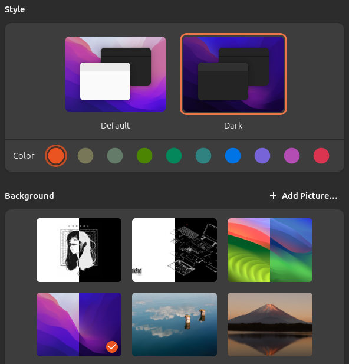

import wallpaperSwitchMP4 from "wallpaper-switch.mp4";

Since the [My 2024 Setup](/blog/2024-setup) post, a few things have changed. I built a new desktop with much newer parts, which caused issues with Fedora KDE Plasma. There was a specific bug where KDE Plasma 6 (running on Wayland) crashed if the proprietary NVIDIA driver was installed, leaving me with a black screen.

_This was supposedly fixed in driver version [565.77](https://www.nvidia.com/en-us/drivers/details/237587/)._

To get the most out of my new system, I had to install Windows. I also switched my Zephyrus G14 to Windows since the fingerprint reader and graphics card didn’t work properly under Linux.

This left me with only Windows machines. I didn’t want to use virtual machines to play with Linux, so I looked for affordable hardware I could buy, something I wouldn’t store valuable data on. That’s when I remembered the praise older ThinkPads get for their value and Linux compatibility. A quick browse on Tweakers led me to a refurbished T480 for 300 euros.

### The T480's Specs

- **Processor:** Intel Core i5-8350U (1.60GHz, 3.60GHz Turbo, Quad-Core, Hyper-Threading)
- **Display:** 14" Full HD (1920 x 1080) IPS Touchscreen
- **RAM:** 16GB DDR4
- **Storage:** 256GB NVMe M.2 SSD
- **Graphics:** Intel UHD 620
- **Audio:** Realtek HD
- **Networking:** Intel Dual-Band AC-8265 (867Mbps), Intel I219-LM Gigabit LAN
- **Mobile Network:** Fibocom 4G/LTE
- **Bluetooth:** Yes
- **Webcam:** Yes
- **Ports:** HDMI, 1x USB-C, 2x USB 3.2 (1 charging), 1x Thunderbolt 3, headset jack
- **Extras:** Backlit keyboard, fingerprint scanner, SD card reader, smart card slot

The laptop arrived in a clean state with Windows 11 preinstalled and the larger external battery, something that wasn't advertised. It was a nice surprise since it improves airflow when the laptop’s on a table. However, it only had 8GB of RAM instead of the advertised 16GB. I called the seller, who apologized and offered two options: send the laptop back for an upgrade or have them send me the RAM to install myself. I chose the latter.

A few days later, the RAM arrived, and I tore open the laptop to install it, an easy process, though prying off the back made some nerve-wracking cracking sounds.

I installed Ubuntu LTS, customized it to my liking, and quickly realized how much I enjoyed using the laptop. The keyboard felt great, the extra touchpad buttons were surprisingly nice to use, it ran almost silently, and Linux worked flawlessly. The only thing that doesn't work is the fingerprint reader, as there aren’t drivers for it in the kernel. I could install a PPA to get it working, but I don’t _need_ it, so I’m skipping that for now.

### Here's some pictures

(Tip: Open the images in a new tab to see them in full detail.)






I've got my G14 Zephyrus with Windows on it for school, but my T480 with Ubuntu is so nice to use that I’m seriously considering switching to less powerful hardware. That said, at the time of writing, Framework is holding an event tomorrow to reveal "the next generation of Framework." So, who knows what I'll be using in a few months?

### Side note

If you're using the GNOME desktop environment and want a custom light/dark mode wallpaper, you can't create one using the GUI yet, but you can do it manually! Here are mine:



<video width="auto" height="auto" controls>
  <source src={wallpaperSwitchMP4} type="video/mp4" />
  If you see this message, your browser does not support the video tag.
</video>

### So how do you create one?

1. Get two images.
2. Create an XML file.

```text
the-name-doesnt-matter.xml
```

It should look like this, with the two images specified:

```xml
<?xml version="1.0"?>
<!DOCTYPE wallpapers SYSTEM "gnome-wp-list.dtd">
<wallpapers>
  <wallpaper deleted="false">
    <name>Default Background</name>
    <filename>/home/filterdwater/Pictures/wallpapers/T480-light.png</filename>
    <filename-dark>/home/filterdwater/Pictures/wallpapers/T480-dark.png</filename-dark>
    <options>zoom</options>
    <shade_type>solid</shade_type>
    <pcolor>#3071AE</pcolor>
    <scolor>#000000</scolor>
  </wallpaper>
</wallpapers>
```

3. From here, you have two options. You can make the custom light/dark mode background available to all users by placing the XML file in this directory:

```
/usr/share/gnome-background-properties
```

Or you can make it available only for a specific user by going to this directory:

```
/home/some-username/.local/share
```

Then creating a `gnome-background-properties` directory and inserting the XML file.

Now you should be able to see and use the custom light/dark mode wallpaper in your appearance settings!
