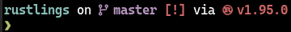
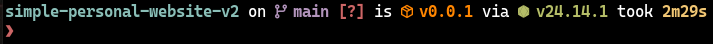
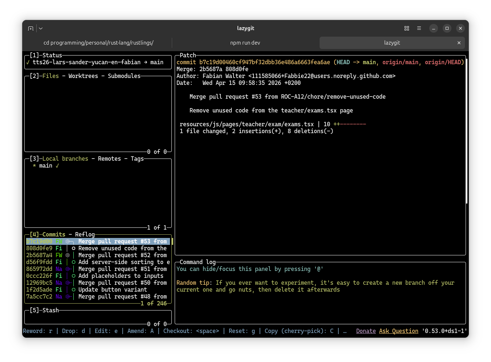
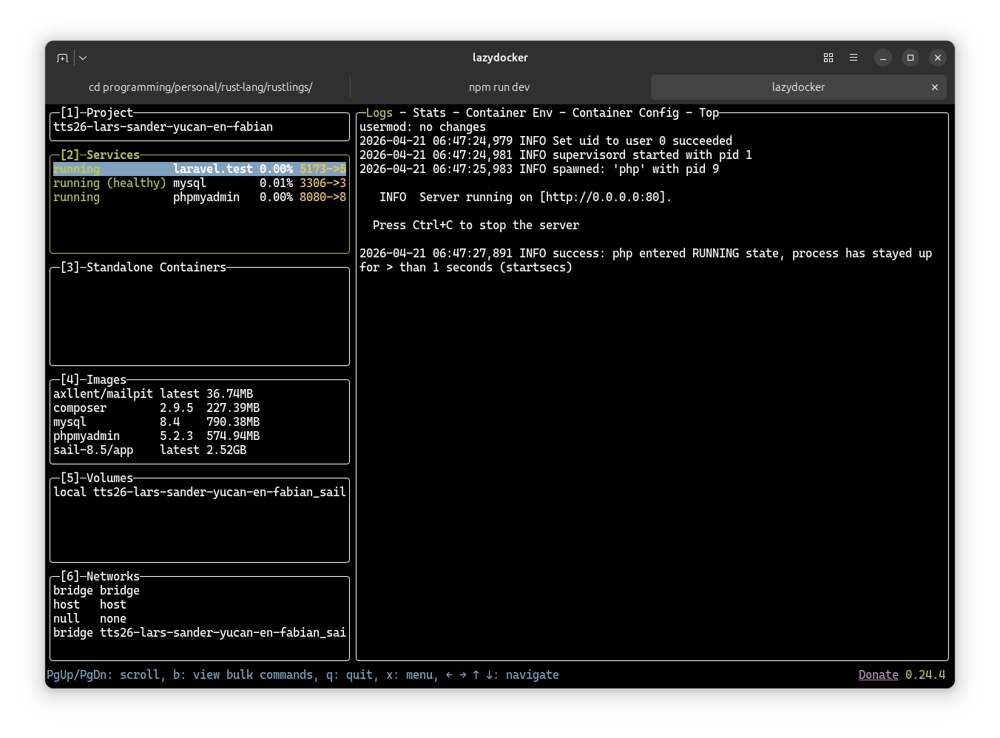
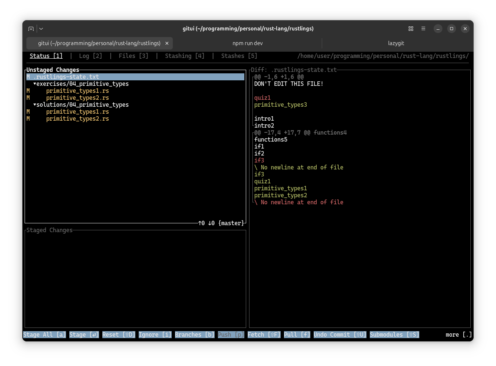
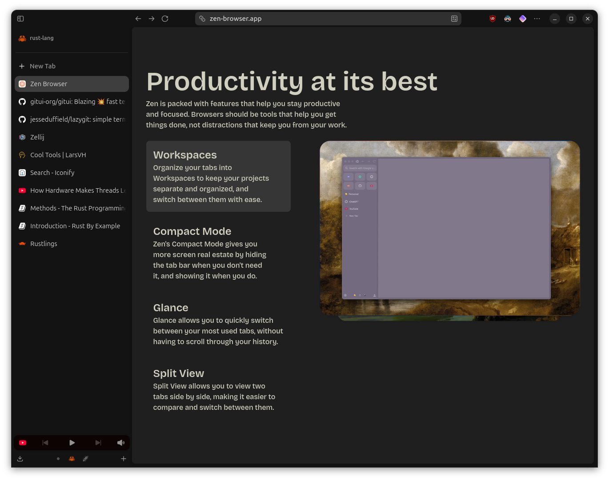
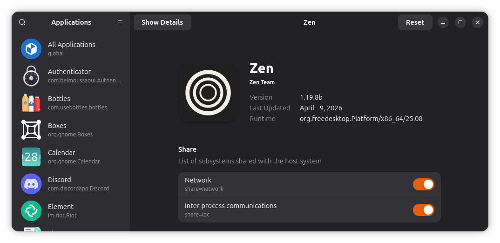

I like discovering and using cool tools. There are many tools out there but these are some I think you should know about.

---

## <span class="flex items-center gap-2"><svg xmlns="http://www.w3.org/2000/svg" width="24" height="24" viewBox="0 0 24 24"><path fill="currentColor" d="M2.25 1.5a.75.75 0 0 0-.75.75v16.5H0V2.25A2.25 2.25 0 0 1 2.25 0h20.095c1.002 0 1.504 1.212.795 1.92L10.764 14.298h3.486V12.75h1.5v1.922a1.125 1.125 0 0 1-1.125 1.125H9.264l-2.578 2.578h11.689V9h1.5v9.375a1.5 1.5 0 0 1-1.5 1.5H5.185L2.562 22.5H21.75a.75.75 0 0 0 .75-.75V5.25H24v16.5A2.25 2.25 0 0 1 21.75 24H1.655C.653 24 .151 22.788.86 22.08L13.19 9.75H9.75v1.5h-1.5V9.375A1.125 1.125 0 0 1 9.375 8.25h5.314l2.625-2.625H5.625V15h-1.5V5.625a1.5 1.5 0 0 1 1.5-1.5h13.19L21.438 1.5z"/></svg>Zed</span>

From the [Zed website](https://zed.dev/): "Zed is a minimal code editor crafted for speed and collaboration with humans and AI."

Zed is written from scratch in Rust to efficiently leverage multiple CPU cores and the GPU. I've mainly used VSCode for a while now and Zed is [really easy to transition to](https://zed.dev/docs/migrate/vs-code#how-to-migrate-from-vs-code-to-zed). It works on MacOS/Linux & Windows.

I've been using Zed beside VSCode (Zed for mostly Rust & VSCode for mostly web dev). Zed has a bunch of functionality which can basically all be turned off or modified in the config files, here are my adjustments:

```json
// Zed settings
//
// For information on how to configure Zed, see the Zed
// documentation: https://zed.dev/docs/configuring-zed
//
// To see all of Zed's default settings without changing your
// custom settings, run `zed: open default settings` from the
// command palette (cmd-shift-p / ctrl-shift-p)
{
  "base_keymap": "VSCode",
  "disable_ai": true,
  "ui_font_size": 16,
  "buffer_font_size": 14,
  "buffer_font_features": {
    "calt": false
  },
  "terminal": {
    "font_family": "CaskaydiaMono Nerd Font"
  },
  "minimap": {
    "show": "always"
  },
  "theme": {
    "mode": "system",
    "light": "Ayu Light",
    "dark": "Ayu Dark"
  },
  "collaboration_panel": {
    "button": false
  },
  "title_bar": {
    "show_sign_in": false
  },
  "outline_panel": {
    "dock": "right"
  },
  "git_panel": {
    "dock": "right"
  },
  "project_panel": {
    "auto_fold_dirs": false,
    "dock": "right"
  }
}
```

```json
// Zed keymap
//
// For information on binding keys, see the Zed
// documentation: https://zed.dev/docs/key-bindings
//
// To see the default key bindings run `zed: open default keymap`
// from the command palette.
[
  {
    "context": "Workspace",
    "bindings": {
      // "shift shift": "file_finder::Toggle"
      "ctrl-b": "workspace::ToggleRightDock",
      "ctrl-alt-b": "workspace::ToggleLeftDock"
    }
  },
  {
    "context": "Editor && vim_mode == insert",
    "bindings": {
      // "j k": "vim::NormalBefore"
    }
  }
]
```

Zed has been around for a bit now and the experience has gotten super polished so if you're interested in writing some Rust or trying a new editor besides VSCode I recommend trying out Zed.

---

## <span class="flex items-center gap-2"><svg xmlns="http://www.w3.org/2000/svg" width="24" height="24" viewBox="0 0 24 24"><path fill="currentColor" d="M12 0C6.7 0 2.4 4.3 2.4 9.6v11.146c0 1.772 1.45 3.267 3.222 3.254a3.18 3.18 0 0 0 1.955-.686a1.96 1.96 0 0 1 2.444 0a3.18 3.18 0 0 0 1.976.686c.75 0 1.436-.257 1.98-.686c.715-.563 1.71-.587 2.419-.018c.59.476 1.355.743 2.182.699c1.705-.094 3.022-1.537 3.022-3.244V9.601C21.6 4.3 17.302 0 12 0M6.069 6.562a1 1 0 0 1 .46.131l3.578 2.065v.002a.974.974 0 0 1 0 1.687L6.53 12.512a.975.975 0 0 1-.976-1.687L7.67 9.602L5.553 8.38a.975.975 0 0 1 .515-1.818m7.438 2.063h4.7a.975.975 0 1 1 0 1.95h-4.7a.975.975 0 0 1 0-1.95"/></svg>Ghostty</span>

From the [Ghostty website](https://ghostty.org/): "Ghostty is a fast, feature-rich, and cross-platform terminal emulator that uses platform-native UI and GPU acceleration".

Ghostty is fairly new and written in Zig. I'm currently running it as a snap package and it works great. If it works on your machine I recommend giving it a shot. It comes with a bunch of stuff I currently don't need just like Zed, and just like it, it is very customizable, although I haven't changed much:

```txt
theme = dark:Ayu,light:Ayu Light
font-family = CaskaydiaMono Nerd Font
```

If you cant install Ghostty you can also try:

## <span class="flex items-center gap-2"><svg xmlns="http://www.w3.org/2000/svg" width="24" height="24" viewBox="0 0 24 24"><path fill="currentColor" d="m10.065 0l-8.57 21.269H5.09L12 5.025l6.91 16.244h3.594L13.934 0zM12 9.935L9.702 15.5c1.475 4.54 1.475 4.54 2.298 8.5c.823-3.96.823-3.96 2.297-8.5z"/></svg>Alacritty</span>

[Alacritty](https://alacritty.org/) is pretty barebones but probably much faster compared to the terminal your OS ships with. Alacritty imo should be configured to use a Nerd Font. Take a look at the docs to see where you need to put this file:

```toml
# .alacritty.toml
[font]
size = 12.0

[font.normal]
family = "CaskaydiaMono Nerd Font"
style = "Regular"

[font.bold]
family = "CaskaydiaMono Nerd Font"
style = "Bold"

[font.italic]
family = "CaskaydiaMono Nerd Font"
style = "Italic"
```

You also need a Nerd Font installed so do that first but the reason I think you should have one is because of software like:

## <span class="flex items-center gap-2"><svg xmlns="http://www.w3.org/2000/svg" width="24" height="24" viewBox="0 0 24 24"><path fill="currentColor" d="M15.521 9.62a1.057 1.057 0 1 1-2.115 0a1.057 1.057 0 0 1 2.115 0M24 12c0 6.627-5.373 12-12 12q-.525 0-1.04-.044c2.019-1.89 2.548-5.061 2.548-5.061l-3.226-1.053s-1.499 3.23-5.599 3.67A11.98 11.98 0 0 1 0 12C0 5.373 5.373 0 12 0s12 5.373 12 12M8.628 6.606c-1.23-.13-1.885-.83-2.03-2.031c-.142 1.159-.77 1.88-2.032 2.031c1.168.227 1.83.918 2.031 2.032c-.02-1.154.666-1.825 2.031-2.032m7.786 5.207c1.11-2.483.392-4.252-1.233-6.246c-2.043 1.5-3.759 3.023-3.636 5.149c-1.375.675-2.261 1.206-3.147 2.289l2.779 1.103l-.368 1.267l3.637 1.062l.443-1.181l2.825.651c.014-1.496-.38-3.097-1.3-4.094"/></svg>Starship</span>

From the [Starship website](https://starship.rs/): "The minimal, blazing-fast, and infinitely customizable prompt for any shell!"

If you don't have this installed I think you're missing out. I could go over the features but I'll just show you a screenshot instead:



As you can see starship shows me which directory I'm in (If your in a directory using Git that will become the visible root in the prompt), that I'm on the master branch with uncommitted changes (modified) and that this directory contains Rust code and I'm using Rust v1.95.0.

If your executing a command it also keeps track of how long it takes:



There are many little things you'll start to notice once your using starship you didn't know you needed but now don't wanna go without.

If you've installed Ghostty you can just create new tabs which works fine for most people. If you've installed Alacritty you can't. Therefore if you're using Alacritty (even if your using Ghostty) I highly suggest trying out:

## <span class="flex items-center gap-2"><svg xmlns="http://www.w3.org/2000/svg" width="24" height="24" viewBox="0 0 24 24"><path fill="currentColor" d="M24 2.251V10.5H12.45V0h9.3A2.25 2.25 0 0 1 24 2.251M12.45 11.4H24v10.5h-.008A2.25 2.25 0 0 1 21.75 24H2.25a2.247 2.247 0 0 1-2.242-2.1H0V2.251A2.25 2.25 0 0 1 2.25 0h9.3v21.6h.9zm11.242 10.5H.308a1.95 1.95 0 0 0 1.942 1.8h19.5a1.95 1.95 0 0 0 1.942-1.8"/></svg>Tmux</span>

From the [Tmux GitHub](https://github.com/tmux/tmux/wiki): "tmux is a terminal multiplexer. It lets you switch easily between several programs in one terminal, detach them (they keep running in the background) and reattach them to a different terminal."

They have a really good getting started guide on their GitHub so click the link and check it out if you're interested. There is also [Zellij](https://zellij.dev/) which is a lot newer but Tmux serves my needs just fine for now.

For Git and Docker I like to use:

## <span class="flex items-center gap-2"><svg xmlns="http://www.w3.org/2000/svg" width="24" height="24" viewBox="0 0 24 24"><path fill="currentColor" d="M2.87 0a2.5 2.5 0 0 0-.697.1q-.187.058-.351.147q-.163.09-.297.213l-.008.006q-.133.124-.235.27a1.7 1.7 0 0 0-.27.643a1.8 1.8 0 0 0 .105 1.023q.072.164.176.308q.105.14.24.26l.007.004q.137.12.299.205q.159.084.348.14q.32.093.682.092h2.8l-4.256 5.09l-.618.733l.01.008q-.046.06-.088.124l-.07.116L.59 9.6q-.03.06-.05.12l-.006.016a1.8 1.8 0 0 0-.122.66q0 .219.042.423q.039.204.12.4q.084.2.21.372a2 2 0 0 0 1.067.746h.002q.397.117.87.117H9.65q.169 0 .338-.02q.163-.02.312-.06l.044-.013q.185-.056.344-.144a1.6 1.6 0 0 0 .297-.21l.012-.01a1.65 1.65 0 0 0 .414-.592q.063-.157.095-.33a2 2 0 0 0 .004-.672a1.6 1.6 0 0 0-.084-.304l-.02-.055a1.5 1.5 0 0 0-.436-.58l-.006-.005a1.65 1.65 0 0 0-.635-.325a2.7 2.7 0 0 0-.675-.087H5.918l4.157-4.95l.243-.304a6 6 0 0 0 .353-.486a2.1 2.1 0 0 0 .262-.64q.075-.315.074-.674q0-.46-.142-.83a1.7 1.7 0 0 0-.437-.648a1.8 1.8 0 0 0-.66-.39A2.6 2.6 0 0 0 8.938 0Zm12.36 6.062q-.179 0-.347.024a2 2 0 0 0-.325.073q-.18.054-.338.142a1.6 1.6 0 0 0-.29.21l-.003.003a1.6 1.6 0 0 0-.394.56q-.065.15-.097.317q-.03.165-.032.337a1.7 1.7 0 0 0 .135.655q.07.162.171.3q.098.131.225.242l.01.012q.133.114.29.197q.155.082.335.134a2.4 2.4 0 0 0 .658.09h2.673L13.82 14.24l-.594.703l.01.008l-.088.123a1 1 0 0 0-.066.113l-.057.112c-.015.036-.046.097-.055.133a1.8 1.8 0 0 0-.118.64a2.1 2.1 0 0 0 .158.796a1.87 1.87 0 0 0 .83.912q.19.102.406.166h.001q.192.057.404.085q.214.03.437.03h6.678q.168 0 .325-.02q.154-.02.304-.06l.042-.012a1.7 1.7 0 0 0 .33-.14q.155-.083.288-.203l.01-.01q.134-.124.233-.265q.103-.146.168-.308q.06-.152.093-.318q.03-.166.03-.34a1.8 1.8 0 0 0-.112-.605l-.02-.05a1.5 1.5 0 0 0-.417-.56l-.004-.004a1.6 1.6 0 0 0-.29-.19a2 2 0 0 0-.332-.128a2.4 2.4 0 0 0-.65-.083h-3.575l3.727-4.435q.154-.182.262-.314l.234-.291a6 6 0 0 0 .34-.47q.085-.137.15-.293a2.4 2.4 0 0 0 .102-.324a2.8 2.8 0 0 0 .07-.65q0-.445-.14-.8a1.7 1.7 0 0 0-.423-.628a1.8 1.8 0 0 0-.639-.377a2.5 2.5 0 0 0-.804-.12Zm-11.39 9.23q-.127 0-.256.016a1.5 1.5 0 0 0-.498.162q-.12.068-.22.158l-.001.004a1.2 1.2 0 0 0-.37.665a1.2 1.2 0 0 0 .002.506a1.15 1.15 0 0 0 .374.65l.01.01a1.2 1.2 0 0 0 .47.25q.23.067.49.067h1.776l-2.833 3.39l-.468.553l.01.007l-.078.124l-.042.084c-.014.03-.027.068-.042.097a1.3 1.3 0 0 0-.09.48q0 .156.03.305q.029.147.088.289q.063.146.152.27a1.4 1.4 0 0 0 .47.413q.142.076.304.125q.142.042.299.063q.159.02.32.02h4.776q.118 0 .24-.014q.118-.015.224-.044l.034-.01q.135-.041.249-.104q.12-.066.219-.154l.007-.008a1.2 1.2 0 0 0 .303-.432q.048-.113.07-.24a1.4 1.4 0 0 0 .002-.486a1.2 1.2 0 0 0-.06-.222l-.016-.042a1.14 1.14 0 0 0-.322-.426a1.2 1.2 0 0 0-.467-.24a1.8 1.8 0 0 0-.483-.06h-2.42l2.768-3.294l.167-.21l.139-.183a2 2 0 0 0 .106-.158q.066-.104.112-.22a1.8 1.8 0 0 0 .115-.472q.014-.126.013-.247q0-.33-.103-.596a1.26 1.26 0 0 0-.32-.47a1.3 1.3 0 0 0-.478-.284a1.8 1.8 0 0 0-.596-.092z"/></svg>Lazy Git & Docker</span>

If your using Git or Docker fully via their own CLI I applaud you but I'm too lazy to learn those so I use these 2:




I'm also trying out GitUI as it claims to be a ton faster than Lazygit and the alternatives. It is purely keyboard driven though so no clicking:



---

## <span class="flex items-center gap-2"><svg xmlns="http://www.w3.org/2000/svg" width="24" height="24" viewBox="0 0 24 24"><path fill="currentColor" d="M24 12c0 6.627-5.373 12-12 12S0 18.627 0 12S5.373 0 12 0s12 5.373 12 12m-12 9.846c5.438 0 9.846-4.408 9.846-9.846S17.438 2.154 12 2.154S2.154 6.562 2.154 12S6.562 21.846 12 21.846M20 12a8 8 0 1 1-16 0a8 8 0 0 1 16 0m-8 6.462a6.462 6.462 0 1 0 0-12.924a6.462 6.462 0 0 0 0 12.924m0-1.847a4.615 4.615 0 1 0 0-9.23a4.615 4.615 0 0 0 0 9.23M15.692 12a3.692 3.692 0 1 1-7.384 0a3.692 3.692 0 0 1 7.384 0"/></svg>Zen Browser</span>

From the [Zen Browser website](https://zen-browser.app/): "Beautifully designed, privacy-focused, and packed with features. We care about your experience, not your data.

I've used Zen for a while now and can definitely recommend it if you want to try out a Firefox based browser. I use Chromium when I need it for things like PWAs but for the rest I exclusively use Zen:



Remember to install [uBlock Origin](https://ublockorigin.com/) when your trying out or using Firefox.

I've installed Zen Browser as a flatpak which means its sandboxed. I've had to adjust the sandboxing for Zen so I could open the local Rust docs on my machine. To do that I recommend using:

## <span class="flex items-center gap-2"><svg xmlns="http://www.w3.org/2000/svg" width="24" height="24" viewBox="0 0 24 24"><path fill="currentColor" d="M20 12c0-4.96-4.04-9-9-9s-9 4.04-9 9s4.04 9 9 9h11v-2h-5.36c2.04-1.65 3.36-4.17 3.36-7m-9-2.5a2.5 2.5 0 0 1 0 5a2.5 2.5 0 0 1 0-5"/></svg>Flatseal</span>

From [Flathub](https://flathub.org/en/apps/com.github.tchx84.Flatseal): "Flatseal is a graphical utility to review and modify permissions from your Flatpak applications."



---

And that was about it for the cool tools! I might add some more later but these are the ones I think you should know about.

---

_First version: 21 Apr, 2026_
