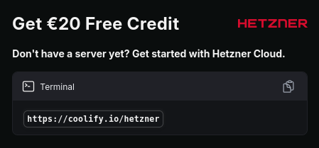
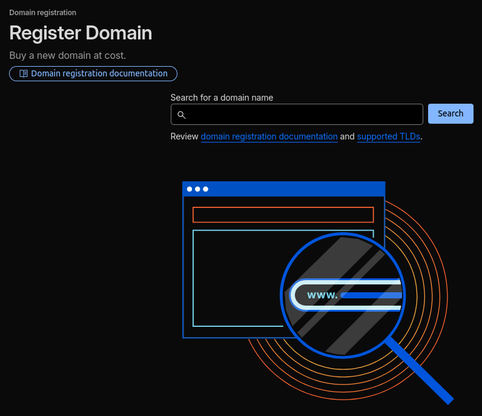
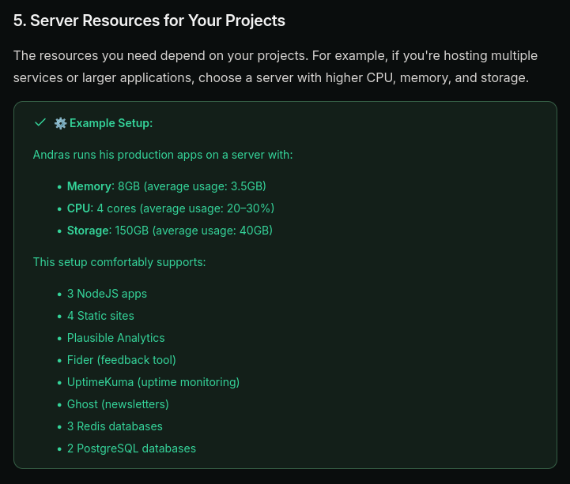
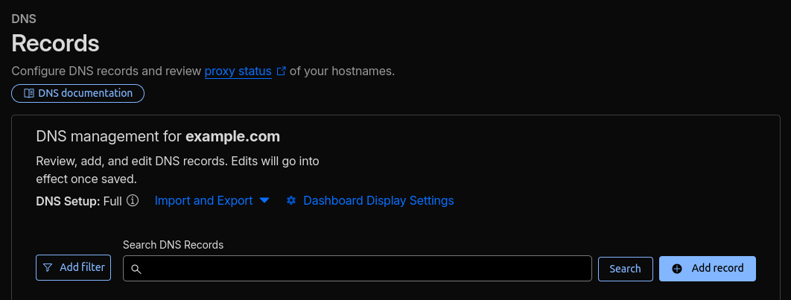
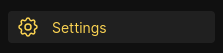
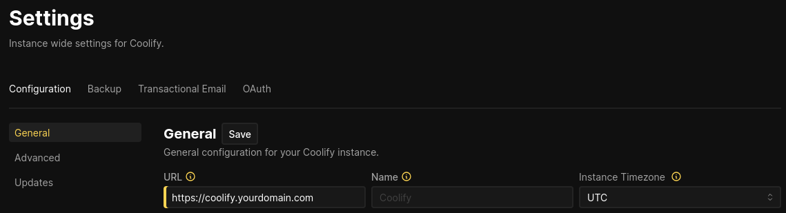
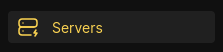
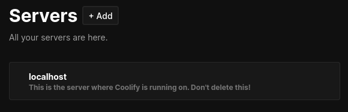
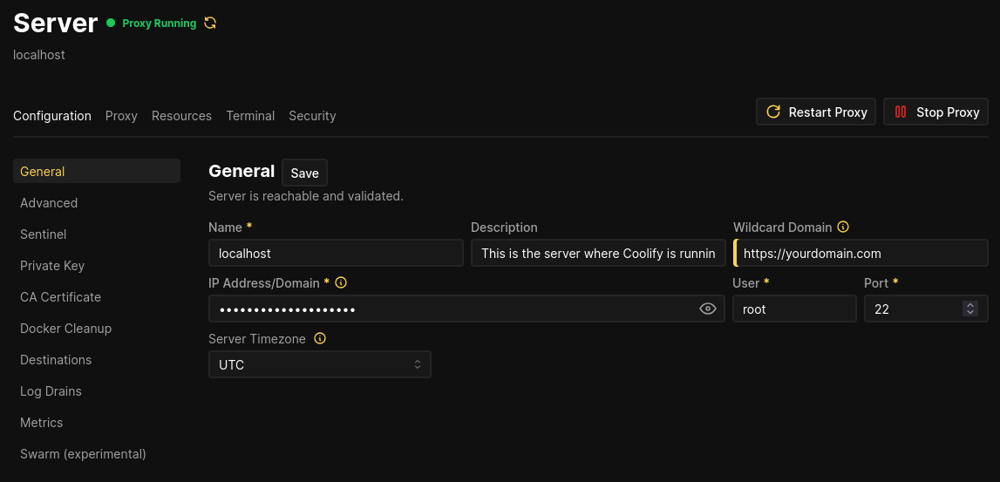
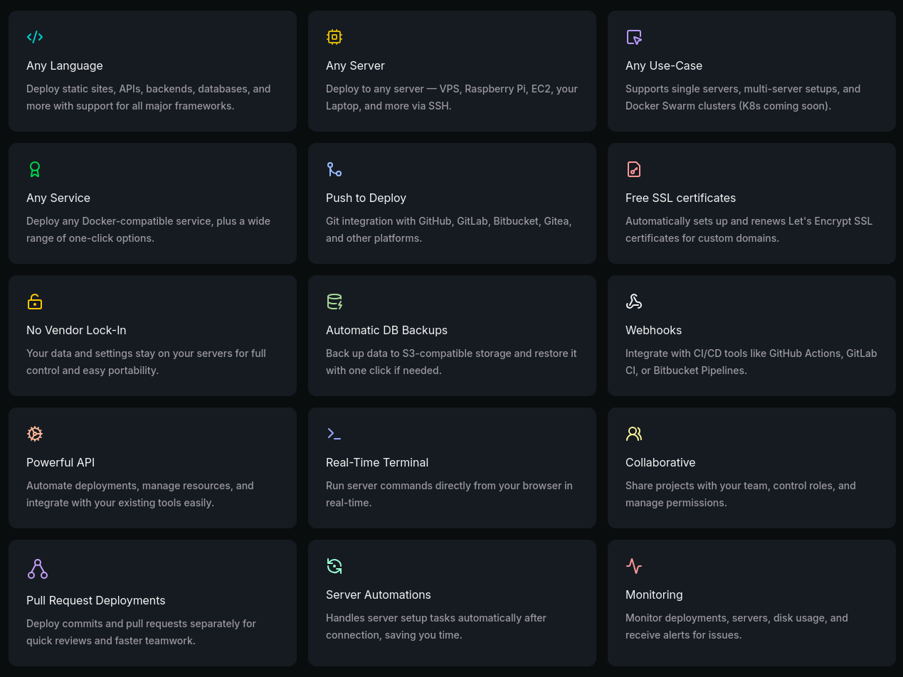

### Prerequisites

A personal:

- Email address
- Phone Number
- PayPal Account (Or other accepted forms of payment for Hetzner & Cloudflare)

---

### The Guide

After you've completed the steps below you should have:

- A Virtual Private Server running Coolify
- Your own domain & secure online access to your Coolify instance via said domain

---

#### 1. Create a [Hetzner account](https://coolify.io/hetzner) as well as a [Cloudflare account](https://dash.cloudflare.com/sign-up)



You can check the [Coolify docs landing page](https://coolify.io/docs/) to see if the Hetzner affiliate link is still there. Remember to disable your ad blocker if you are going to use the affiliate link, just in case.

---

#### 2. Buy a domain using the Cloudflare registrar

Log into Cloudflare, navigate to the domains page, press the **Buy a domain** button, search for a domain you like and buy it if it's available.



---

#### 3. Figure out how much compute you need

You can always upgrade your VPS later on if you really need the extra compute so don't worry too much about choosing too little compute. The Coolify docs have a good example to get a better sense of what you might need.



You can find this example [in the docs](https://coolify.io/docs/get-started/installation#_5-server-resources-for-your-projects). I personally use the cheapest option and scale when I need to.

---

#### 4. Buy a VPS from Hetzner

1. Choose a resource type + x86 architecture
2. Choose a location
3. Choose an image

I've chosen to use the **OS Images** tab to create my VPS instead of the Coolify app in the **Apps** tab so I can set up the server myself and follow the Coolify docs step by step. Besides that, the Coolify app from the **Apps** tab uses Ubuntu, which is fine, but I don't need to worry about hardware, in which case I prefer to use Debian.

I won't go into the differences between Debian and Ubuntu, you can look into that yourself. You can choose either one from the **OS Images** tab and still follow this guide. I haven't tried the Coolify app from the **Apps** tab so your on your own if you choose that route.

4. Choose your networking options (defaults are good)
5. SSH keys

You can choose to not provide an SSH key which will make Hetzner send you your VPS's root login via Email (plain text username & password). I recommend using SSH right of the bat, as does Hetzner.

If you don't have an SSH key pair, run (on a Unix like OS: Linux / macOS):

```bash
ssh-keygen
```

Use the default save location and decide for yourself whether you want to give your private key a passphrase.

After you finish setting up the SSH key pair, run (on a Unix like OS: Linux / macOS):

```bash
cat ~/.ssh/id_ed25519.pub
```

Select the output with your mouse and copy it using **ctrl + shift + c**. Go back to the Hetzner VPS creation screen, press the **Add SSH key** button, paste the public key in the SSH Key field and press **Add SSH key**.

6. Volumes (skip)
7. Firewalls (skip, for now)
8. Backups (skip)
9. Placement groups (skip)
10. Labels (skip)
11. Cloud config (skip)
12. Choose a name, I left mine as the default
13. Double check what you've selected
14. Press **the Create & Buy now** button

##### 4.1 Connect to & update your VPS

After Hetzner creates your VPS, try connecting to it using the command below (SSH key required) (on a Unix like OS: Linux / macOS):

```bash
ssh root@<Your-VPS's-public-IP>
```

You should be prompted to trust the connection & (if you entered one) for your private SSH Key passphrase.

If you've connected succesfully, great! If not, you can try figuring out what went wrong by re-running the command using the -v, -vv or -vvv (the more Vs the more verbose the debug info) flag like so:

```bash
ssh -v root@<Your-VPS's-public-IP>
```

I'm going to assume that you figured how to connect to your VPS and we can move on.

Lets update your VPS's mirrors and upgrade its packages!

These command works without sudo since you should be logged in as root. Keep this in mind as its the most priviliged user and has full control over your VPS

```bash
apt update && apt upgrade -y
```

After the commands finish I suggest rebooting your VPS by sending it a reboot command:

```bash
reboot
```

You can check on your Hetzner dashboard when the VPS comes back online.

---

#### 5. Installing Coolify on your VPS

The Coolify docs have a great [step-by-step guide](https://coolify.io/docs/get-started/installation) on how to install Coolify. **CAREFULLY** read & follow the docs using either the script or manual installation method, come back here to move forward with the next step after you're done with that.

Note: you're going to need to configure a Firewall (INBOUND ports) in the Hetzner console, use the **TCP** protocol for all the ports you open up for traffic.

---

#### 6. Pointing your domain to your VPS

Start by copying your VPS’s public IP address.
Then open your Cloudflare dashboard and navigate to DNS → Records.

Press **Add record**:



Create a new **A** record with the following values:

```txt
Type: A
Name: *
Content: <Your-VPS's-public-IP>
Proxy status: DNS only
TTL: Auto
```

This wildcard record ensures that any subdomain you later configure inside Coolify, such as **app.yourdomain.com** or **api.yourdomain.com**, will automatically resolve to your VPS unless you explicitly create a different DNS record in the Cloudflare Dashboard which takes priority over the Coolify configured one.

#### 5.1. (Optional)

If you want your apex domain (e.g., **yourdomain.com**) to also point to your VPS, add a second **A** record with the same settings, but replace the \* with @:

```txt
Type: A
Name: @
Content: <Your-VPS's-public-IP>
Proxy status: DNS only
TTL: Auto
```

This allows you to deploy something on the apex domain using Coolify.

##### About the @ and \* symbols

These symbols aren’t unique to Cloudflare, most DNS providers (Namecheap, GoDaddy, DigitalOcean, etc.) use the same shorthand conventions:

**@** Represents your apex domain, meaning the domain itself without any subdomain.

**\*** Is a wildcard that matches any subdomain that doesn’t already have its own DNS record. This is part of the DNS standard, and providers expose it directly so you can easily route all undefined subdomains.

These symbols are simply user‑friendly conventions used across many DNS dashboards. The underlying DNS system doesn’t literally store **@** or **\*** as names.

---

#### 7. Configuring Coolify to use your domain

If I had to take a guess you are currently accessing the dashboard using http://<your-vps's-ip>:8000 which shouldn't be your permanent solution as it's not secure. Fixing this is very simple if you followed the guide properly up until now.

Navigate to the settings page, the link for which can be found in the Coolify sidebar / navigation.



On the settings page you should see a field with the label **URL**, change this fields value to **https://<coolify.yourdomain.com>** and press the **Save** button. You can swap out the Coolify part for any subdomain you want to use to access Coolify, but just using Coolify makes the most sense for my use case.



Now let's start the Traefik proxy to wrap everything up.

Navigate to the servers page, the link for which can be found in the Coolify sidebar / navigation.



On the servers page you should see localhost, that is the machine your Coolify instance is running on.



Click on the localhost link to navigate to its settings screen where you can configure the "Wildcard Domain" which should be your apex domain **https://<yourdomain.com>** after which you can save that change and start the proxy by pressing the start button located near the top right of the page.



After the proxy has started and the Coolify UI indicates it is running you can try navigating to your Coolify instance using **https://<coolify.yourdomain.com>** or whatever subdomain you configured to access Coolify.

You might need to wait a second for Coolify to generate an SSL Certificate for your subdomain. Which is one of the many features you'll be enjoying in just a bit!



---

#### 8. Remove unused / unnecessary ports from Firewall configuration

If you followed the docs to set up Coolify you probably have ports: 6001, 6002 and 8000 open. Here is what they do as a reminder:

- 6001 – Real-time communications
- 6002 – Terminal access (Required for Coolify version 4.0.0-beta.336 and above)
- 8000 – HTTP access to the Coolify dashboard

These ports are only required for the listed functionality when you haven't enabled the Traefik proxy. After you've enabled the Traefik proxy you can remove these ports from your Firewall.

---

#### 9. Start using Coolify

That was everything you needed to do to set up a Coolify instance on your VPS! I've been happy with the features it provides, and I think you'll be too. Check out [the docs](https://coolify.io/docs/), their pretty good! It also contains guides for deploying popular frameworks or software which has been valuable to me before.
