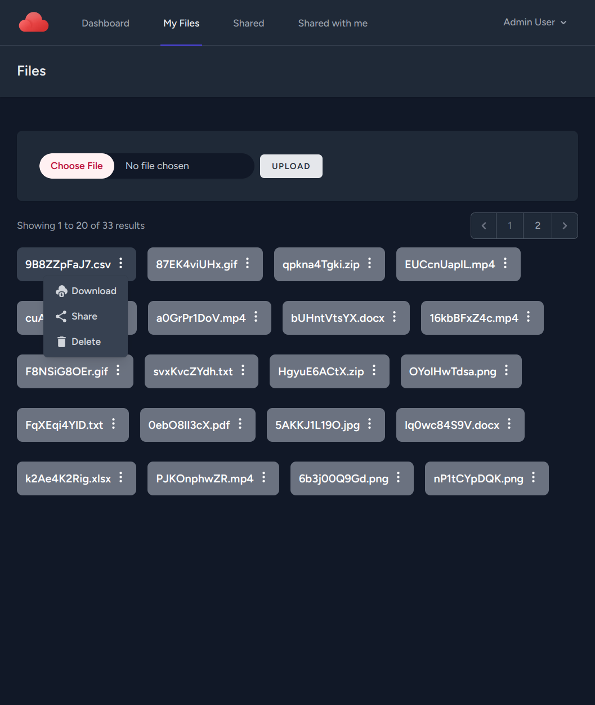
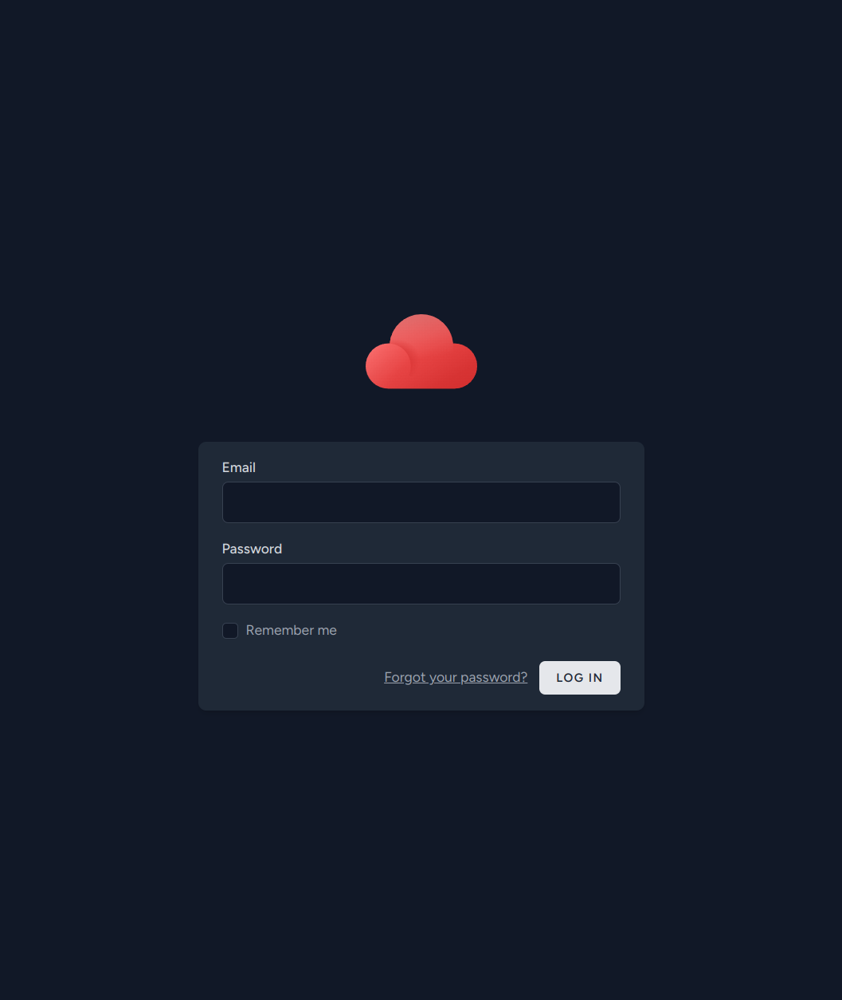
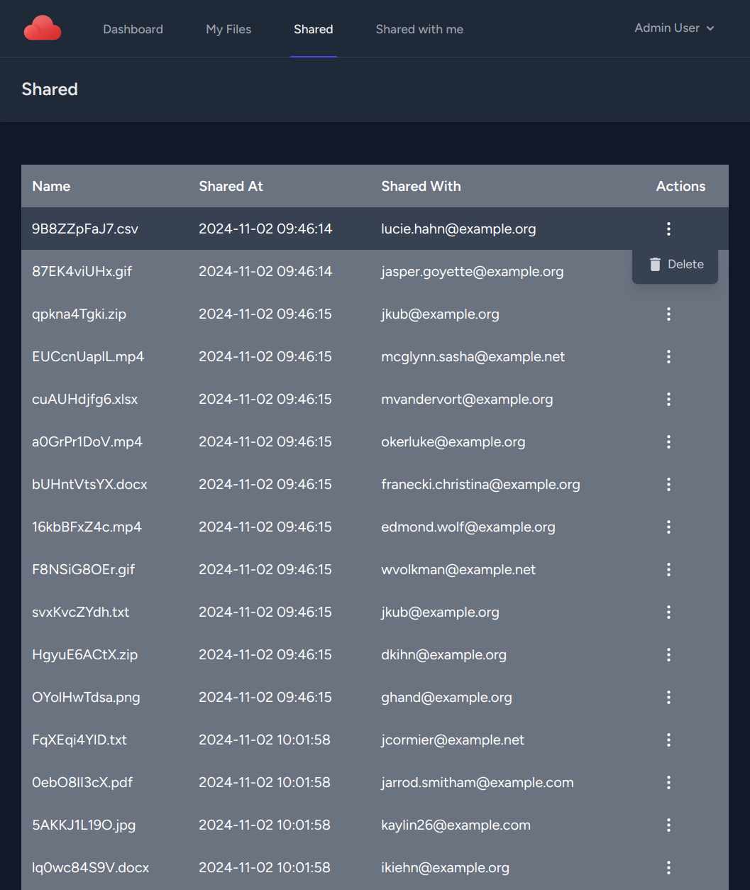
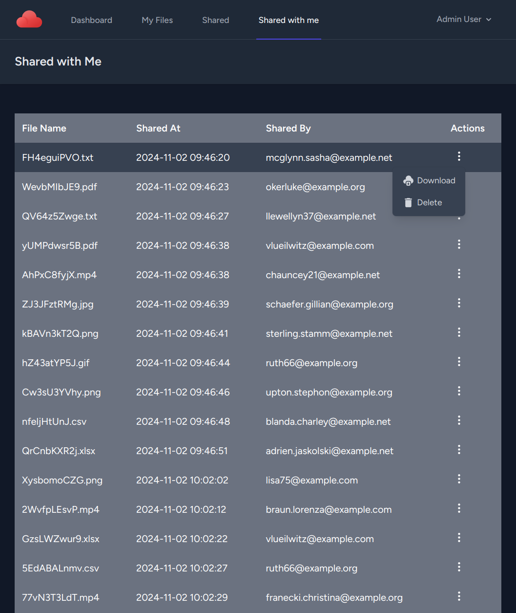
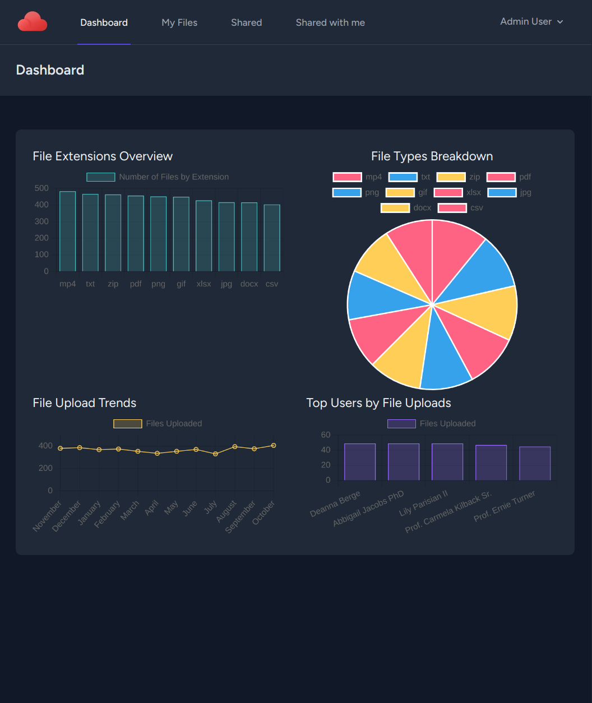
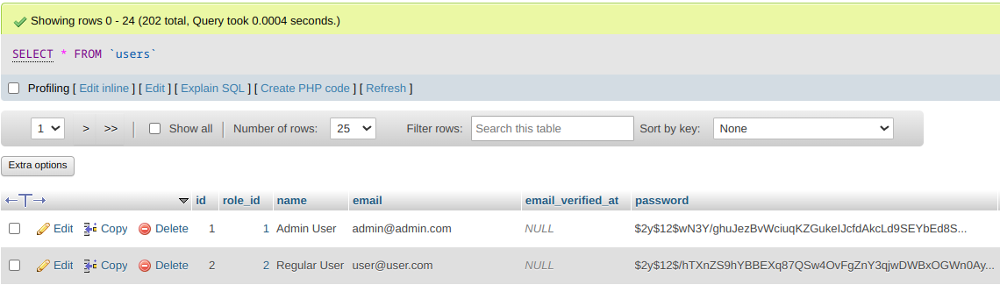
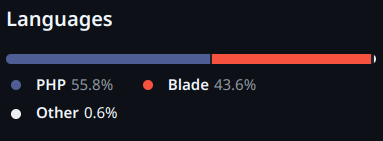

# ☁️ Cloud Storage Application

A cloud storage application built using Laravel, designed to offer secure and user-friendly file management.

---

## 📁 Project Overview

This project was developed as part of a school assignment with the goal of creating a fully functional cloud storage application. Key features include:

**User-Friendly Interface**  
 Provides an intuitive web interface for seamless navigation and file management.  
 

**User Authentication**  
 Allows users to register and log in, ensuring secure access to personal files.  
 

**File Operations**  
 Users can upload, download, and delete files, as well as share files via email.  
 

**Shared Files Section**  
 View files shared by others, with options to download or remove sharing links while retaining the files with the original owner.  
 

**Admin Dashboard**  
 Offers administrators usage statistics and insights into user activity.  
 

**Enhanced Security**  
 Implements best practices, such as secure password storage and restricted database access.  
 

**DRY Principle**  
 Follows the "Don't Repeat Yourself" principle to ensure efficient and maintainable code.

**Comprehensive Project Plan**  
 A detailed project plan outlines requirements, objectives, and deliverables.

**Technology Stack**  
 Developed with PHP, HTML, CSS, and relevant frameworks for a robust and scalable application.  
 

**Database & Data Targets**  
 The database contains substantial test data, aiming for over 100 users, 500 files, and 200 shares.

---

## ⚙️ Setup Instructions

Have Docker installed? You can set up this project locally to view it in the browser with fake users and files by following the instructions in the README file on GitHub.
