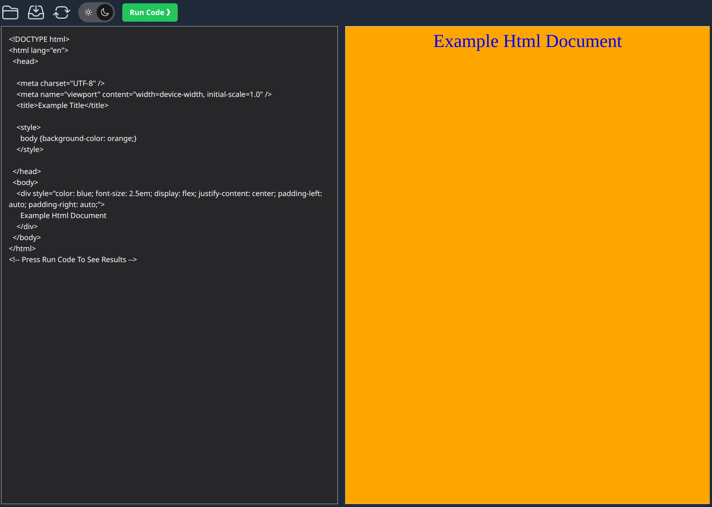
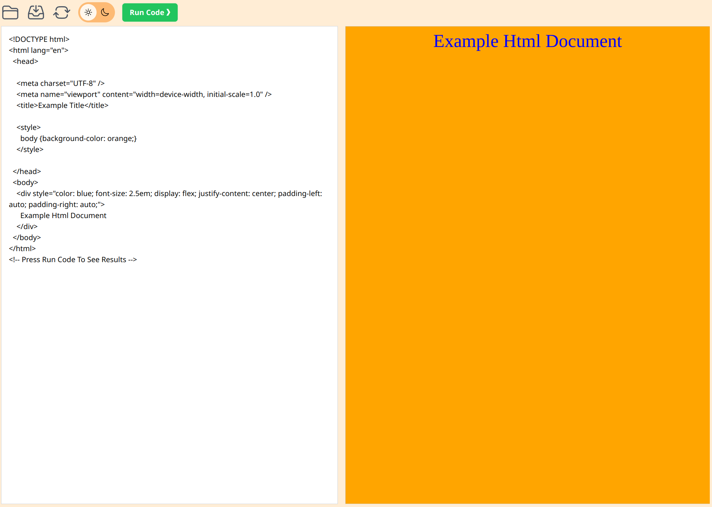
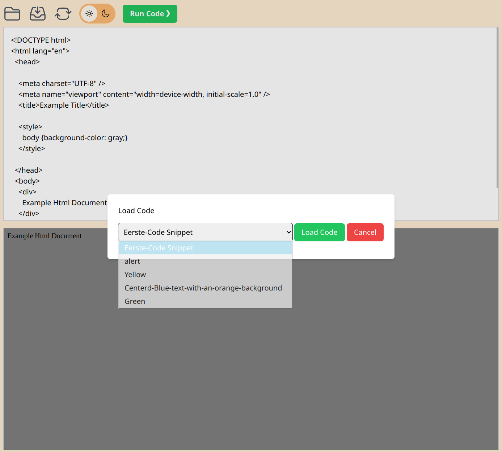

# 🧑‍💻 Tryit Editor

A web-based editor inspired by the W3Schools Tryit Editor, allowing users to write and preview HTML, CSS, and JavaScript code.

---

## 📁 Project Overview

This Tryit Editor clone was developed as a school project with the following features:

- **Code Execution**  
  Users can write HTML, CSS, and JavaScript code and view the output in a preview panel by clicking on the run code button, helping them understand the effect of their code changes in real time.

- **Save & Share Code**  
  Users can save their code snippets, enabling others to load and try them out directly within the editor.

---

## 📸 Interface Previews

Here are some screenshots showcasing the editor's dark and light modes, as well as the "Load Code" feature:

**Dark Mode**  
 

**Light Mode**  
 

**Load Code Feature**  
 
